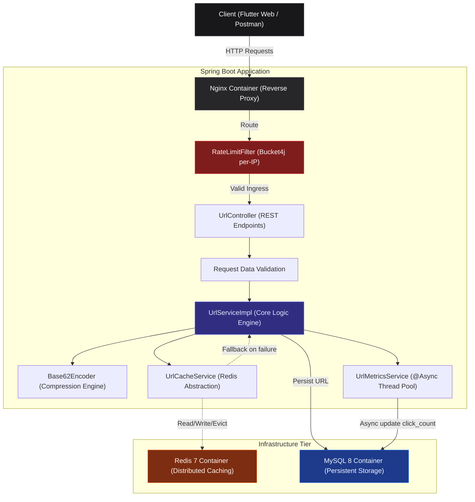

# 🔗 URL Shortener

A **production-ready URL Shortener** backend built with Java 17+ & Spring Boot 3. 
Designed as a **portfolio-grade** project demonstrating enterprise patterns: Redis caching, async processing, rate limiting, and clean layered architecture.

---

## 📐 Architecture

### Overall System Architecture



---

## 🗂️ Folder Structure

```
src/main/java/com/urlshortener/
├── UrlShortenerApplication.java     # Main Spring Boot entry point (@EnableAsync)
├── cache/
│   └── UrlCacheService.java         # Abstracts RedisTemplate; implements silent fallback if Redis is down
├── config/
│   ├── CorsConfig.java              # Configures global CORS (dev vs prod origins)
│   ├── RateLimitFilter.java         # Bucket4j per-IP rate limit filter
│   ├── RedisConfig.java             # Configures RedisTemplate (String keys/values)
│   └── SwaggerConfig.java           # Springdoc OpenAPI UI configuration
├── controller/
│   └── UrlController.java           # REST endpoints (POST, GET, DELETE)
├── dto/
│   └── CreateUrlRequest.java        # Bean Validation for incoming requests
├── entity/
│   └── UrlEntity.java               # JPA Entity mapping to the `urls` table
├── exception/
│   ├── GlobalExceptionHandler.java  # @RestControllerAdvice for unified JSON errors
│   ├── InvalidUrlException.java     # Thrown for malformed URLs
│   ├── RateLimitExceededException.java
│   └── UrlNotFoundException.java    
├── repository/
│   └── UrlRepository.java           # Spring Data JPA interface (MySQL/H2)
├── response/
│   ├── ErrorResponse.java           # Standardized error JSON payload
│   └── UrlResponse.java             # Standardized success JSON payload
├── service/
│   ├── UrlMetricsService.java       # Handles async click tracking
│   ├── UrlService.java              # Core interface
│   └── UrlServiceImpl.java          # Core logic (SHA-256 duplicate detection, Base62 encoding)
└── util/
    └── Base62Encoder.java           # Converts Long IDs to Base62 short codes
```

---

## ✨ Implemented Features

| Feature | Implemented | Description | Responsible Classes |
|---|:---:|---|---|
| URL Shortening | ✅ | Converts long URL into a short code | `UrlController`, `UrlServiceImpl` |
| Redirect | ✅ | 301 redirects short code to original URL | `UrlController`, `UrlServiceImpl` |
| Analytics | ✅ | Tracks clicks and last accessed time | `UrlController`, `UrlServiceImpl` |
| Duplicate Detection | ✅ | Prevents storing the same URL twice | `UrlServiceImpl` (via `url_hash`) |
| SHA-256 Hashing | ✅ | Generates a 64-char hash for duplicate checks | `UrlServiceImpl` |
| Base62 Encoding | ✅ | Compresses IDs using 0-9A-Za-z | `Base62Encoder` |
| Redis Cache | ✅ | Caches redirects to bypass DB lookups | `UrlCacheService` |
| Redis Fallback | ✅ | System survives if Redis crashes | `UrlCacheService` |
| Local Profile | ❌ | **Not Implemented** (See `test` profile instead) | N/A |
| H2 Database | ✅ | In-memory DB used for testing/local isolation | `application-test.yml` |
| MySQL | ✅ | Primary persistent storage | `application.yml` |
| Docker | ✅ | Containerized app, DB, and cache | `Dockerfile`, `docker-compose.yml` |
| Swagger | ✅ | Auto-generated OpenAPI documentation | `SwaggerConfig` |
| Validation | ✅ | Rejects empty or invalid URLs | `CreateUrlRequest` |
| Exception Handling | ✅ | Standardized API errors | `GlobalExceptionHandler` |
| Async Processing | ✅ | Non-blocking click analytics updates | `UrlMetricsService` |
| Rate Limiting | ✅ | Bucket4j prevents API abuse | `RateLimitFilter` |
| Health Endpoint | ✅ | Spring Actuator health monitoring | `application.yml` |
| Logging | ✅ | Configured SLF4J logging levels per profile | `application.yml` |
| Testing | ✅ | 48 tests across all layers | `*Test.java` files |

*(Note: During audit, it was confirmed that a dedicated `local` profile does not exist. However, the `test` profile perfectly achieves isolated local development via H2 and disabled Redis).*

---

## 🔄 Request Lifecycle

### POST `/api/v1/urls` (Shortening)
`Client` ➔ `RateLimitFilter` (Check IP limit) ➔ `UrlController` ➔ `CreateUrlRequest` (Validate URL format) ➔ `UrlServiceImpl` ➔ `SHA-256` (Hash URL) ➔ `UrlRepository` (Check duplicate hash) ➔ **If new:** `UrlRepository` (Save empty code for ID) ➔ `Base62Encoder` (Encode ID) ➔ `UrlRepository` (Update shortCode) ➔ `UrlCacheService` (Cache in Redis) ➔ `UrlResponse`

### GET `/{shortCode}` (Redirect)
`Client` ➔ `RateLimitFilter` ➔ `UrlController` ➔ `UrlServiceImpl` ➔ `UrlCacheService` (Redis Lookup) ➔ **If Miss:** `UrlRepository` (MySQL Lookup) + Populate Cache ➔ `UrlMetricsService` (@Async Increment Clicks) ➔ `301 Moved Permanently`

---

## ⚡ Cache Architecture & Flows

### Cache Hit
`Client` ➔ `Controller` ➔ `UrlCacheService` ➔ **Found in Redis** ➔ `Response` (DB bypassed)

### Cache Miss
`Client` ➔ `Controller` ➔ `UrlCacheService` ➔ **Not Found** ➔ `UrlRepository` (MySQL) ➔ `UrlCacheService` (Save to Redis) ➔ `Response`

### Redis Fallback (Fault Tolerance)
`Client` ➔ `Controller` ➔ `UrlCacheService` ➔ **Redis Connection Refused/Timeout** ➔ `Exception Caught Silently` ➔ `UrlRepository` (Fallback to MySQL) ➔ `Response` (Application continues normally)

---

## ⚙️ Configuration & Profiles

All configuration is managed inside `src/main/resources/application.yml` and `src/test/resources/application-test.yml`.

| Profile | Database | Cache | Flyway | Logging | Purpose |
|---|---|---|---|---|---|
| `default` | MySQL | Redis | Disabled | INFO | Base configuration inherited by others |
| `dev` | MySQL (Update) | Redis | Disabled | DEBUG | Active local development (auto schema updates) |
| `docker` | MySQL (Update) | Redis | Disabled | INFO | Running inside `docker-compose` |
| `prod` | MySQL (Validate) | Redis | Enabled | INFO | Production deployment (strict schema validation) |
| `test` | **H2 (In-Memory)** | **Disabled** | Disabled | INFO | Isolated testing & local running without infra |

---

## 💻 Local Development (No Infra Required)

If you want to run the application locally **without** installing MySQL or Redis, you can utilize the `test` profile. This profile auto-configures an in-memory **H2 database** and completely disables Redis auto-configuration.

**Startup Command:**
```bash
./mvnw spring-boot:run -Dspring-boot.run.profiles=test
```
*Why this exists: To allow immediate contributor onboarding and rapid UI development without needing to spin up Docker containers or local databases.*

---

## 🧪 Testing Documentation

The repository features a robust test suite of **48 tests** ensuring absolute stability across all architectural layers.

| Test Class | Framework | Layer | Strategy & Purpose |
|---|---|---|---|
| `UrlShortenerApplicationTests` | SpringBootTest | Context | Verifies the entire Spring context boots successfully (using mocked RedisTemplate). |
| `UrlControllerTest` | MockMvc | Controller | `@WebMvcTest` isolates the web layer, mocks services, and asserts HTTP status codes/JSON. |
| `UrlServiceImplTest` | Mockito | Service | Pure unit tests mocking dependencies (Cache/DB) to test SHA-256, Base62 logic, and exception throwing. |
| `UrlRepositoryTest` | DataJpaTest | Repository | Isolated JPA tests running on H2 to verify custom queries and duplicate constraint handling. |
| `Base62EncoderTest` | JUnit 5 | Utility | Parameterized tests asserting exact Base62 alphabet (`0-9A-Za-z`) mathematical conversions. |

---

## 🚀 Quick Start

### Option A: Local Sandbox (No Infra)
Run entirely in-memory using H2. No MySQL or Redis required.
```bash
./mvnw clean spring-boot:run -Dspring-boot.run.profiles=test
```

### Option B: Full Production Stack (Docker)
Spins up the full stack (Spring Boot, MySQL 8, Redis 7, Flutter Web) exactly as it would run in production.
```bash
docker-compose up -d --build
```
Access the backend API at `http://localhost:8080/swagger-ui.html` and the frontend at `http://localhost:80`.

---

## 🛠️ Technology Stack

| Technology | Purpose | Layer |
|---|---|---|
| **Spring Boot 3.3** | Core application framework | Backend |
| **Spring MVC** | RESTful endpoint routing | Backend |
| **Spring Data JPA** | Database abstraction layer | Backend |
| **Hibernate** | ORM provider | Backend |
| **MySQL 8** | Primary persistent relational database | Infrastructure |
| **Redis 7** | Distributed in-memory caching | Infrastructure |
| **H2 Database** | In-memory DB for tests and sandbox | Infrastructure |
| **Bucket4j** | Token-bucket rate limiting filter | Security |
| **Docker & Compose** | Containerization and orchestration | DevOps |
| **JUnit 5 & Mockito** | Testing frameworks | Testing |
| **MockMvc** | Controller testing | Testing |
| **Swagger (OpenAPI)** | Interactive API documentation | API |
| **Flutter / Dart** | Cross-platform web frontend | Frontend |
| **Maven** | Build and dependency management | Build |

---

## 📄 License
MIT License.
