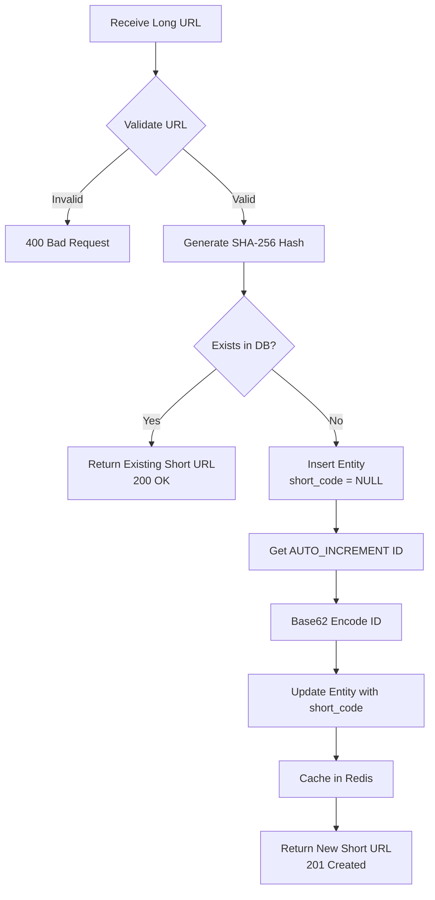
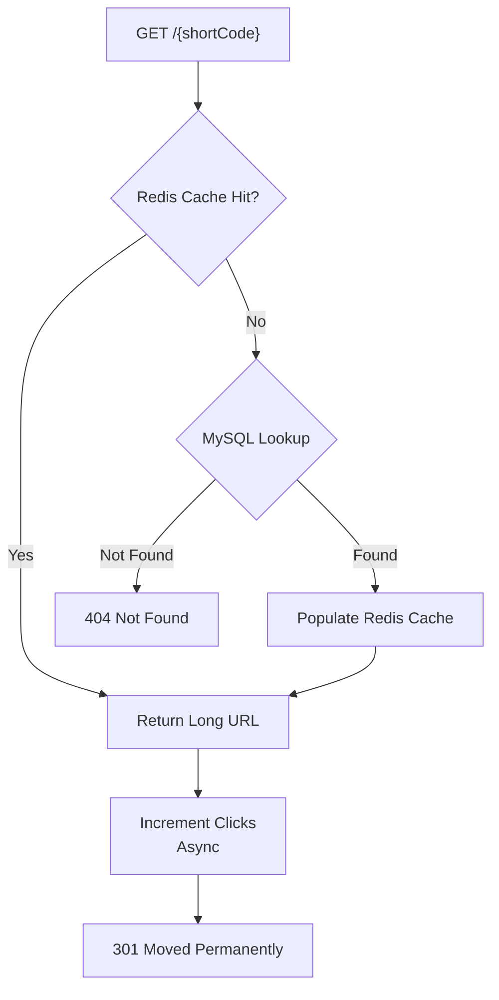

# 🔗 URL Shortener

A **production-ready URL Shortener** backend built with Java 17+ & Spring Boot 3, inspired by [Alex Xu's *System Design Interview*](https://www.amazon.com/System-Design-Interview-insiders-Second/dp/B08CMF2CQF) book.

Designed as a **portfolio-grade** project demonstrating enterprise patterns: Redis caching, async processing, rate limiting, and clean layered architecture.

---

## 📐 Architecture

```mermaid
graph TB
    subgraph Client
        A[Browser / Postman]
    end

    subgraph "Spring Boot Application"
        B[RateLimitFilter<br/>Bucket4j per-IP]
        C[UrlController<br/>REST API]
        D[UrlServiceImpl<br/>Business Logic]
        E[UrlMetricsService<br/>@Async Click Tracking]
        F[UrlCacheService<br/>Redis Abstraction]
    end

    subgraph Infrastructure
        G[(MySQL 8<br/>Primary Storage)]
        H[(Redis 7<br/>Cache Layer)]
    end

    A -->|HTTP| B
    B --> C
    C --> D
    D --> F
    D --> E
    F --> H
    D --> G
    E -->|Async| G

    style B fill:#ff6b6b,stroke:#333,color:#fff
    style H fill:#6c5ce7,stroke:#333,color:#fff
    style G fill:#0984e3,stroke:#333,color:#fff
```

### Shortening Flow



### Redirect Flow



---

## 🛠️ Tech Stack

| Layer | Technology |
|---|---|
| Language | Java 17+ |
| Framework | Spring Boot 3.3 |
| Build | Maven (with wrapper) |
| Database | MySQL 8 |
| Cache | Redis 7 |
| ORM | Spring Data JPA / Hibernate |
| Validation | Jakarta Bean Validation |
| Rate Limiting | Bucket4j |
| API Docs | Springdoc OpenAPI (Swagger UI) |
| Testing | JUnit 5, Mockito, MockMvc, H2 |
| Containerization | Docker, Docker Compose |
| Productivity | Lombok |

---

## 🚀 Quick Start

### Prerequisites

- **Java 17+** (JDK)
- **Maven 3.8+** (or use the included Maven wrapper `./mvnw`)
- **MySQL 8** running on port `3306`
- **Redis 7** running on port `6379`

### Option 1: Run with Docker Compose (Recommended)

```bash
# Clone the repository
git clone https://github.com/yourusername/url-shortener.git
cd url-shortener

# Start all services (app + MySQL + Redis)
docker-compose up -d

# Verify health
curl http://localhost:8080/actuator/health
```

### Option 2: Run Locally

```bash
# 1. Ensure MySQL and Redis are running locally

# 2. Create the database
mysql -u root -p -e "CREATE DATABASE IF NOT EXISTS url_shortener;"

# 3. Build and run
./mvnw clean package -DskipTests
java -jar target/url-shortener-1.0.0.jar --spring.profiles.active=dev
```

### Option 3: Run Tests Only

```bash
./mvnw clean test
```

---

## 📡 API Endpoints

| Method | Endpoint | Description | Status Codes |
|---|---|---|---|
| `POST` | `/api/v1/urls` | Create short URL | `201`, `200`, `400`, `429` |
| `GET` | `/{shortCode}` | Redirect to original URL | `301`, `404` |
| `GET` | `/api/v1/urls/{shortCode}/analytics` | Fetch analytics | `200`, `404` |
| `DELETE` | `/api/v1/urls/{shortCode}` | Soft delete URL | `204`, `404` |
| `GET` | `/actuator/health` | Health check | `200` |
| `GET` | `/swagger-ui/index.html` | Swagger UI | `200` |

### Example: Create Short URL

```bash
curl -X POST http://localhost:8080/api/v1/urls \
  -H "Content-Type: application/json" \
  -d '{"longUrl": "https://www.google.com/search?q=system+design"}'
```

**Response (201 Created):**
```json
{
  "shortCode": "aB3kPq",
  "shortUrl": "http://localhost:8080/aB3kPq",
  "longUrl": "https://www.google.com/search?q=system+design",
  "createdAt": "2026-06-20T01:00:00"
}
```

### Example: Get Analytics

```bash
curl http://localhost:8080/api/v1/urls/aB3kPq/analytics
```

**Response (200 OK):**
```json
{
  "shortCode": "aB3kPq",
  "shortUrl": "http://localhost:8080/aB3kPq",
  "longUrl": "https://www.google.com/search?q=system+design",
  "clickCount": 42,
  "createdAt": "2026-06-20T01:00:00",
  "lastAccessed": "2026-06-20T12:30:00"
}
```

---

## 📁 Project Structure

```
src/main/java/com/urlshortener/
├── UrlShortenerApplication.java     # Main class (@EnableAsync)
├── cache/
│   └── UrlCacheService.java         # Redis abstraction (get/set/evict)
├── config/
│   ├── CorsConfig.java              # CORS (all origins dev, restricted prod)
│   ├── RateLimitFilter.java         # Bucket4j per-IP rate limiting
│   ├── RedisConfig.java             # RedisTemplate with String serializers
│   └── SwaggerConfig.java           # OpenAPI metadata
├── controller/
│   └── UrlController.java           # REST endpoints
├── dto/
│   └── CreateUrlRequest.java        # Validated request DTO
├── entity/
│   └── UrlEntity.java               # JPA entity → urls table
├── exception/
│   ├── GlobalExceptionHandler.java  # @RestControllerAdvice
│   ├── InvalidUrlException.java     # 400
│   ├── RateLimitExceededException.java  # 429
│   └── UrlNotFoundException.java    # 404
├── repository/
│   └── UrlRepository.java           # Spring Data JPA
├── response/
│   ├── ErrorResponse.java           # Standardized error payload
│   └── UrlResponse.java             # Unified response DTO
├── service/
│   ├── UrlMetricsService.java       # @Async click tracking
│   ├── UrlService.java              # Service interface
│   └── UrlServiceImpl.java          # Core business logic
└── util/
    └── Base62Encoder.java           # ID ↔ shortCode conversion
```

---

## 🗄️ Database Schema

```sql
CREATE TABLE urls (
    id            BIGINT AUTO_INCREMENT PRIMARY KEY,
    short_code    VARCHAR(10) UNIQUE NULL,
    url_hash      VARCHAR(64) UNIQUE NOT NULL,
    long_url      VARCHAR(2048) NOT NULL,
    click_count   BIGINT DEFAULT 0,
    is_active     BOOLEAN DEFAULT TRUE,
    created_at    TIMESTAMP DEFAULT CURRENT_TIMESTAMP,
    last_accessed TIMESTAMP NULL
);
```

**Why `short_code` is nullable**: Supports the two-phase insert pattern — first insert gets the auto-increment ID, then Base62(ID) generates the short code.

**Why `url_hash`**: SHA-256 hash of the long URL enables efficient duplicate detection via a `VARCHAR(64)` index instead of indexing the full 2048-char URL.

---

## ⚙️ Configuration

All secrets and environment-specific values are externalized:

| Variable | Default | Description |
|---|---|---|
| `MYSQL_HOST` | `localhost` | MySQL hostname |
| `MYSQL_PORT` | `3306` | MySQL port |
| `MYSQL_DATABASE` | `url_shortener` | Database name |
| `MYSQL_USERNAME` | `root` | DB username |
| `MYSQL_PASSWORD` | `root` | DB password |
| `REDIS_HOST` | `localhost` | Redis hostname |
| `REDIS_PORT` | `6379` | Redis port |
| `BASE_URL` | `http://localhost:8080` | Public-facing base URL |
| `SERVER_PORT` | `8080` | Application port |
| `CORS_ALLOWED_ORIGINS` | `*` | Comma-separated allowed origins |
| `SPRING_PROFILES_ACTIVE` | — | `dev`, `docker`, or `prod` |

### Profiles

| Profile | Schema Init | Flyway | SQL Logging | Use Case |
|---|---|---|---|---|
| `dev` | `schema.sql` | Disabled | DEBUG | Local development |
| `docker` | `schema.sql` | Disabled | INFO | Docker Compose |
| `prod` | Disabled | `V1__init.sql` | INFO | Production |

---

## 🧪 Testing

**37 tests** across 4 layers:

```bash
# Run all tests
./mvnw clean test

# Run specific test class
./mvnw test -Dtest=UrlServiceImplTest
```

| Suite | Tests | Layer | Strategy |
|---|---|---|---|
| `Base62EncoderTest` | 8 | Utility | Pure JUnit (no Spring) |
| `UrlServiceImplTest` | 10 | Service | Mockito mocks |
| `UrlControllerTest` | 11 | Controller | MockMvc (@WebMvcTest) |
| `UrlRepositoryTest` | 8 | Repository | H2 in-memory (@DataJpaTest) |

---

## 🐳 Docker

```bash
# Build and start all services
docker-compose up -d

# View logs
docker-compose logs -f app

# Stop all services
docker-compose down

# Stop and remove volumes (reset DB)
docker-compose down -v
```

**Services:**

| Service | Image | Port (Host) | Port (Container) |
|---|---|---|---|
| `app` | Built from Dockerfile | 8080 | 8080 |
| `mysql` | `mysql:8.0` | 3307 | 3306 |
| `redis` | `redis:7-alpine` | 6380 | 6379 |

---

## ☁️ Deployment

### Render

1. Create a new **Web Service** on [Render](https://render.com)
2. Connect your GitHub repository
3. Set **Build Command**: `./mvnw clean package -DskipTests`
4. Set **Start Command**: `java -jar target/url-shortener-1.0.0.jar`
5. Add environment variables:
   - `SPRING_PROFILES_ACTIVE=prod`
   - `MYSQL_HOST`, `MYSQL_PORT`, `MYSQL_DATABASE`, `MYSQL_USERNAME`, `MYSQL_PASSWORD`
   - `REDIS_HOST`, `REDIS_PORT`
   - `BASE_URL=https://your-app.onrender.com`
6. Create a **MySQL** and **Redis** service on Render and link them

### Railway

1. Create a new project on [Railway](https://railway.app)
2. Add **MySQL** and **Redis** plugins from the dashboard
3. Deploy from GitHub — Railway auto-detects Spring Boot
4. Set environment variables (Railway auto-injects DB/Redis connection strings):
   - `SPRING_PROFILES_ACTIVE=prod`
   - `BASE_URL=https://your-app.up.railway.app`
   - Map Railway's MySQL variables to `MYSQL_HOST`, `MYSQL_USERNAME`, etc.
5. Railway handles builds automatically via the `Dockerfile`

### AWS EC2

1. Launch an EC2 instance (Amazon Linux 2 / Ubuntu)
2. Install Docker and Docker Compose:
   ```bash
   sudo yum install -y docker
   sudo service docker start
   sudo curl -L "https://github.com/docker/compose/releases/latest/download/docker-compose-$(uname -s)-$(uname -m)" -o /usr/local/bin/docker-compose
   sudo chmod +x /usr/local/bin/docker-compose
   ```
3. Clone the repository and set environment variables:
   ```bash
   git clone https://github.com/yourusername/url-shortener.git
   cd url-shortener
   export BASE_URL=http://your-ec2-public-ip:8080
   ```
4. Start with Docker Compose:
   ```bash
   docker-compose up -d
   ```
5. Configure Security Group to allow inbound traffic on port `8080`
6. (Optional) Set up **Nginx** as a reverse proxy with SSL via Let's Encrypt

---

## 📬 Postman

Import the included Postman collection:

**File:** `url-shortener.postman_collection.json`

The collection includes:
- 12 requests covering all endpoints and edge cases
- Collection variables: `{{base_url}}`, `{{short_code}}`
- Auto-chaining: "Create Short URL" saves `short_code` for subsequent requests
- Test assertions on every request

---

## 📄 License

MIT License — see [LICENSE](LICENSE) for details.
